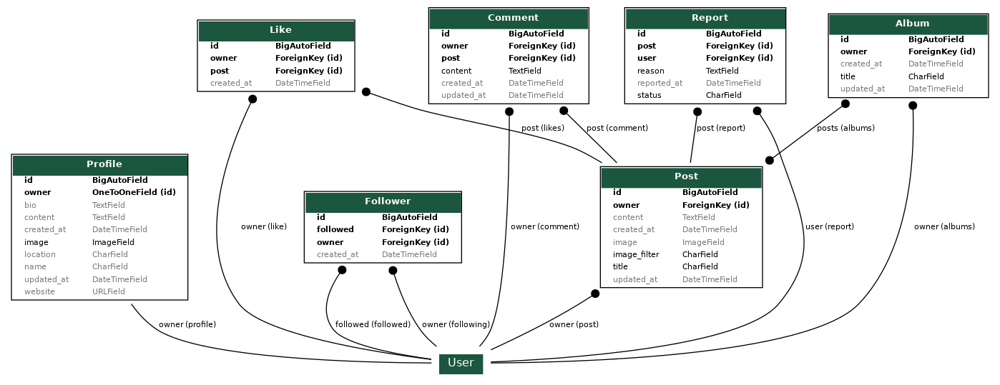

# Time - Backend

## Introduction


Welcome to my RESTful API, created for my frontend React application, Time.

The API is live at: [Time back-end](https://time-2a8aec1abfbd.herokuapp.com/)

You can explore the front-end code for this API on GitHub: [Time front-end](https://github.com/hogbergmarkus/time),

And the deployed front-end can be accessed here: [Time](https://pp5-api-f-176f17fcc3bf.herokuapp.com/)

This API encompasses all the necessary logic that enables users to perform CRUD operations on the frontend.

Time serves as a photo-sharing platform where users can upload images to share with others.

Photos uploaded to the site are also available for download by other users, fostering a community of sharing.

Users can sign up to engage in activities such as uploading and downloading images, liking and commenting on them, and saving images to albums in their profiles.

## Table of Contents

- [Introduction](#introduction)
- [Design](#design)
  - [Entity Relational Diagram](#entity-relational-diagram)
  - [API Endpoints](#api-endpoints)
- [Testing](#testing)
  - [Unit Tests](#unit-tests)
  - [Validation](#validation)
  - [Manual Testing](#manual-testing)
    - [root_route](#root_route)
    - [albums](#albums)
    - [comments](#comments)
    - [likes](#likes)
    - [posts](#posts)
    - [profiles](#profiles)
    - [reports](#reports)
- [Deployment](#deployment)
  - [Cloning and Forking](#cloning-and-forking)
- [Technologies Used](#technologies-used)
  - [Languages](#languages)
  - [Frameworks](#frameworks)
  - [Libraries](#libraries)
    - [Authentication](#authentication)
    - [Database](#database)
    - [Image Handling](#image-handling)
    - [Utilities](#utilities)
  - [Database Used](#database-used)
  - [Image Storage](#image-storage)
  - [Deployment Service](#deployment-service)
- [Bugs](#bugs)
  - [Bug ](#bug)
- [Fixed Bugs](#fixed-bugs)
  - [Bug Fix 1](#bug-fix)
- [Credits](#credits)
  - [Moments](#moments)

## Design

### Entity Relational Diagram

In my design phase, I mapped out my models using a spreadsheet.

This project draws inspiration from the [Moments](https://github.com/Code-Institute-Solutions/moments/tree/304244f540308ff4dd3c961352f55a633a4b3bed) walkthrough project, which means some code may be identical or similar.

However, I have customized it to align with the specific requirements of my project.

Consequently, the [backend](https://github.com/Code-Institute-Solutions/drf-api/tree/ed54af9450e64d71bc4ecf16af0c35d00829a106) shares certain similarities with the Moments project, though I will highlight key differences that make it unique.

- **My Like Model:**

  Unlike the Moments model, mine allows users to like both posts and comments.

  Additionally, posts and comments can be liked independently of each other.

- **My Post Model:**

  My model incorporates [django-taggit](https://django-taggit.readthedocs.io/en/latest/) to enable users to add tags to their posts.

  This feature enhances the searchability that the Moments project lacks.

  Furthermore, users can download images, and my model tracks the number of times each image has been downloaded.

- **My Album Model:**

  The Moments project does not include this feature.

  My model enables users to create albums on their profile pages to save posts.

- **My Report Model:**

  This feature is absent in the Moments project.

  Users have the ability to report posts if they find the content inappropriate for any reason.

The results can be visualized here:




### API Endpoints

Here are the API endpoints utilized by my API:


## Testing

### Unit Tests

I have developed approximately 50 automated tests for my views, all of which have passed.

- Album view tests can be found here: [Album view tests]()

- Comment view tests are available here: [Comments view tests]()

- Like view tests can be accessed here: [Likes view tests]()

- Post view tests can be found here: [Posts view tests]()

- Profile view tests are available here: [Profile view tests]()

- Report view tests can be accessed here: [Report view tests]()

### Validation

All files that I created or modified were checked using the [PEP8 CI python linter](https://pep8ci.herokuapp.com/), with no errors or warnings found.

### Manual Testing

Every item listed under "Works" was manually tested, and marked with an X for yes if it functions correctly, or no if it does not.

#### root_route

|Works                                              |YES |NO |
|---------------------------------------------------|:---:|---|
|The root_route URL loads                           |X  |   |
|Welcome message is displayed on the landing page   |X  |   |

#### albums

|Works                                                   |YES |NO |
|--------------------------------------------------------|:---:|---|
|`albums/` is not accessible if not logged in            |X  |   |
|`albums/<int:pk>/` is not accessible if not logged in   |X  |   |
|`albums/` is accessible to users if logged in           |X  |   |
|`albums/<int:pk>/` is accessible to users if logged in   |X  |   |
|Logged-in users can create an album and add posts to it  |X  |   |
|Logged-in users can view their albums                    |X  |   |
|Logged-in users can update an album                      |X  |   |
|Logged-in users can delete an album                      |X  |   |

#### comments

|Works                                                                |YES |NO |
|---------------------------------------------------------------------|:---:|---|
|`comments/` is accessible if not logged in as read-only              |X  |   |
|`comments/<int:pk>/` is accessible if not logged in as read-only     |X  |   |
|Users can read comments but cannot create them if not logged in      |X  |   |
|If signed in, users can create a comment                            |X  |   |
|Comments cannot be edited if the user is not logged in              |X  |   |
|Comments cannot be deleted if the user is not logged in             |X  |   |
|Comments can be edited by their owner                                |X  |   |
|Comments can be deleted by their owner                               |X  |   |

#### likes

|Works                                                                |YES |NO |
|---------------------------------------------------------------------|:---:|---|
|`likes/` is accessible if not logged in as read-only                 |X  |   |
|`likes/<int:pk>/` is accessible if not logged in as read-only        |X  |   |
|Users can see likes even when not logged in                         |X  |   |
|Users cannot add likes if not logged in                             |X  |   |
|If signed in, users can add a like to a post                        |X  |   |
|If signed in, users can add a like to a comment                     |X  |   |
|Likes cannot be deleted if the user is not logged in as the owner   |X  |   |
|Likes can be deleted if logged in as their owner                    |X  |   |
|Users cannot like the same item more than once                     |X  |   |

#### posts

|Works                                                                    |YES |NO |
|-------------------------------------------------------------------------|:---:|---|
|`posts/` is accessible if not logged in as read only                     |X  |   |
|`posts/<int:pk>/` is accessible if not logged in as read only            |X  |   |
|`posts/<int:pk>/download/` is not accessible if not logged in            |X  |   |
|I can see but not add posts if not logged in                             |X  |   |
|If I am signed in, I can add a post                                      |X  |   |
|Posts can not be edited if not logged in as the owner                    |X  |   |
|Posts can not be deleted if not logged in as its owner                   |X  |   |
|Posts can be edited by its owner                                         |X  |   |
|Posts can be deleted by its owner                                        |X  |   |
|I can increment download count by posting to `posts/<int:pk>/download/`  |X  |   |
|comments_count increments by one when I add a comment to a post          |X  |   |
|likes_count increments by one when I add a like to a post                |X  |   |
|I can upload an image to a post                                          |X  |   |
|File extension must be jpg, jpeg or png when uploading an image          |X  |   |
|If file extension is not jpg, jpeg or png an error informs the user      |X  |   |

#### Posts

| Works                                                                    | YES | NO |
|-------------------------------------------------------------------------|:---:|---|
| `posts/` is accessible without logging in, as read-only                 | X  |   |
| `posts/<int:pk>/` is accessible without logging in, as read-only        | X  |   |
| `posts/<int:pk>/download/` is not accessible without logging in         | X  |   |
| I can view posts but cannot add them if not logged in                   | X  |   |
| If I am logged in, I can add a post                                     | X  |   |
| Posts cannot be edited if the user is not logged in as the owner        | X  |   |
| Posts cannot be deleted if the user is not logged in as the owner       | X  |   |
| Posts can be edited by their owner                                       | X  |   |
| Posts can be deleted by their owner                                      | X  |   |
| I can increment the download count by accessing `posts/<int:pk>/download/` | X  |   |
| `comments_count` increases by one when I add a comment to a post        | X  |   |
| `likes_count` increases by one when I add a like to a post              | X  |   |
| I can upload an image to a post                                          | X  |   |
| When uploading an image, the file extension must be jpg, jpeg, or png   | X  |   |
| If the file extension is not jpg, jpeg, or png, an error message is shown to the user | X  |   |

#### Profiles

| Works                                                                | YES | NO |
|---------------------------------------------------------------------|:---:|---|
| `profiles/` is accessible without logging in, as read-only          | X  |   |
| `profiles/<int:pk>/` is accessible without logging in, as read-only | X  |   |
| `profiles/<int:pk>/` is accessible without logging in, as read-only | X  |   |
| A new profile is created for the user upon registration              | X  |   |
| As the owner, I can update my profile                               | X  |   |
| I can add a profile image                                            | X  |   |
| If I don't own the profile, I can only view it                      | X  |   |

#### Reports

| Works                                                                | YES | NO |
|---------------------------------------------------------------------|:---:|---|
| `reports/` is not accessible without logging in                     | X  |   |
| `reports/` is accessible when logged in                              | X  |   |
| When logged in, I can report a post                                  | X  |   |
| I can view reports made by users in the admin panel                 | X  |   |

## Deployment

I began by setting up a database on [Elephant SQL](https://www.elephantsql.com/).

On [Heroku](https://www.heroku.com/), I created my app. In the app's settings page, I added the following configuration variables:

- **DATABASE_URL** with the value of my PostgreSQL server URL.
- **SECRET_KEY** with a value obtained from [Djecrety](https://djecrety.ir/).
- **DISABLE_COLLECTSTATIC** set to 1.
- **CLOUDINARY_URL** with the value of my Cloudinary API environment variable.

In my IDE, I installed `dj_database_url` and `psycopg2` using the command:

- ```pip3 install dj_database_url==0.5.0 psycopg2```

Then, include `dj_database_url` in your `settings.py` file.

In `settings.py`, I modified the Database section to utilize my local `db.sqlite3` server during development, 

and switch to my PostgreSQL server in production.

Here's the code snippet for that:

```python
if 'DEV' in os.environ:
    DATABASES = {
        'default': {
            'ENGINE': 'django.db.backends.sqlite3',
            'NAME': BASE_DIR / 'db.sqlite3',
        }
    }
else:
    DATABASES = {
        'default': dj_database_url.parse(os.environ.get("DATABASE_URL"))
    }
```

Next, I added os.environ['DATABASE_URL'] = 'my-ElephantSQL-database-url' to my env.py file.

In the same env.py, I also defined os.environ['DEV'] = '1', allowing me to implement conditional logic in settings.py,

enabling a seamless switch between development and production environments.

Temporarily comment out the DEV variable in the env.py file to allow the IDE to connect to the external database.

In settings.py, insert a print statement here:

```
else:
    DATABASES = {
        'default': dj_database_url.parse(os.environ.get("DATABASE_URL"))
    }
    print("connected to external database")
```

Then, run the following command in your terminal:

- ```python3 manage.py makemigrations --dry-run```

You should see: "connected to external database" printed in the terminal.

Remove the print statement and proceed to migrate the database:

- ```python3 manage.py migrate```

To create a superuser, run:

- ```python3 manage.py createsuperuser```

Next, navigate to Elephant SQL, and select the database you just created.

On the left side navigation, click "Browser", then choose "Table queries", and from the list, select "auth_user".

Finally, click "Execute", and you should see your superuser listed.

Back in the IDE, I installed gunicorn and django-cors-headers using the following command:

- ```pip3 install gunicorn django-cors-headers```

Gunicorn is necessary for deploying to Heroku, and we need django-cors-headers

since the frontend and backend will be hosted on different domains.

To save the installed packages to requirements.txt, run:

pip freeze --local > requirements.txt
Create a Procfile in the root directory, and add the following content:

- ```pip freeze --local > requirements.txt```

Create a Procfile in the root directory, and add this inside:

```
release: python manage.py makemigrations && python manage.py migrate
web: gunicorn <your-project-name>.wsgi
```

InIn settings.py, I included os.environ.get('ALLOWED_HOST') in ALLOWED_HOSTS,

and in env.py, I added os.environ['ALLOWED_HOST'] = '<my-gitpod-workspace-url>'.

I implemented this after my first deployment, which prevented me from accessing my project,

but with the deployed URL now available, I returned to my app on Heroku, navigated to settings, revealed config vars, and entered ALLOWED_HOST with the value of my deployed URL.

Back in the IDE, I added 'corsheaders' to INSTALLED_APPS.

I also added 'corsheaders.middleware.CorsMiddleware', to the top of the MIDDLEWARE list in settings.py.

Continuing in settings.py, we need to establish some allowed origins for CORS

to ensure network requests aren’t blocked. Note that this code is tailored specifically for use with GitPod

and may require different configurations for your setup.

```
if 'CLIENT_ORIGIN' in os.environ:
    CORS_ALLOWED_ORIGINS = [
        os.environ.get('CLIENT_ORIGIN')
    ]
if 'CLIENT_ORIGIN_DEV' in os.environ:
    extracted_url = re.match(
        r'^.+-', os.environ.get('CLIENT_ORIGIN_DEV', ''),
        re.IGNORECASE
        ).group(0)
    CORS_ALLOWED_ORIGIN_REGEXES = [
        rf"{extracted_url}(eu|us)\d+\w\.gitpod\.io$",
    ]
```

We also need to ensure that we can send cookies across origins for authentication purposes.

So, add ```CORS_ALLOW_CREDENTIALS = True``` to settings.py.

Since the frontend app and this API will be deployed to different URLs,

the JWT_AUTH_SAMESITE needs to be set to a value of None in settings.py, or cookies will be blocked:

```
REST_AUTH = {
    'USE_JWT': True,
    'JWT_AUTH_SECURE': True,
    'JWT_AUTH_COOKIE': 'my-app-auth',
    'JWT_AUTH_REFRESH_COOKIE': 'my-refresh-token',
    'JWT_AUTH_SAMESITE': 'None',
    'USER_DETAILS_SERIALIZER': 'time_api.serializers.CurrentUserSerializer'
}
```

Ensure that you replaced your SECRET_KEY with something similar to this:

```SECRET_KEY = os.getenv('SECRET_KEY')```, and make sure to set a new value for it

in `env.py` or another secure file that you won't push to a public repository.

I added this to my `env.py`: ```os.environ.setdefault("SECRET_KEY", "MyNewRandomValueHere")```

I modified the `DEBUG` setting in `settings.py` to: ```DEBUG = 'DEV' in os.environ```,

which makes it easier to avoid toggling `DEBUG` between True and False during development.

Next, I uncommented the `DEV` line in `env.py`.

Again, I verified that my `requirements.txt` was up-to-date, and then pushed the changes to GitHub.

On Heroku, open the deploy tab for the app, select "Connect to GitHub",

search for the repository, and click connect.

Finally, click "Deploy Branch". Once the build process completes, your app should open and function as expected.

### Cloning and Forking

If you wish to clone or fork this project, you can do so from my [GitHub repository](https://github.com/fgit-24/drf-api-time).

It's advisable to set up a virtual environment first.

**Cloning** the project allows you to create a local copy of the project on your machine,

enabling you to make modifications without affecting the original repository.

**Forking** it creates a copy of the project in your own GitHub account,

allowing you to propose changes to the original project 

or develop your modified version of it.

Next, you will need to reinstall the dependencies listed in the `requirements.txt` file using:

- ```pip install -r requirements.txt```

You will also have to configure your own environment variables.

## Technologies Used

### Languages

This API was developed using Python.

### Frameworks

- Django
  
  The primary framework that serves as the foundation for this API.

- django-rest-framework
  
  A framework built on top of Django, used for crafting RESTful APIs.

### Libraries

#### Authentication

- dj-rest-auth
  
  Enables `django-rest-framework` to provide authentication endpoints easily.

- django-allauth
  
  A comprehensive authentication application for Django.

- djangorestframework-simplejwt
  
  JSON Web Token-based authentication, which will be utilized for authentication from the frontend.

#### Database

- dj-database-url
  
  Assists in parsing URLs for straightforward configuration in Django.

- psycopg2
  
  A PostgreSQL adapter for Python.

#### Image Handling

- cloudinary
  
  Facilitates interaction with Cloudinary, a cloud-based image storage service.

- django-cloudinary-storage
  
  Integrates Cloudinary for media storage within Django.

- Pillow
  
  Used for image processing tasks.

#### Utilities

- gunicorn
  
  A WSGI server used in production, necessary for deployment.

- django-cors-headers
  
  Adds Cross-Origin Resource Sharing headers to allow requests to a Django application from other origins.

- django-taggit
  
  Used for adding tags to posts in this project, enhancing the searchability of content.

### Database Used

For this project, I employed a PostgreSQL database via [Elephant SQL](https://www.elephantsql.com/).

### Image Storage

I utilized [Cloudinary](https://cloudinary.com/) for image storage.

### Deployment Service

The project was deployed using [Heroku](https://www.heroku.com/).

## Bugs

### Fixed Bugs

### Bug Fix 


## Credits

### Moments

This project drew inspiration from [Moments](https://github.com/Code-Institute-Solutions/moments/tree/304244f540308ff4dd3c961352f55a633a4b3bed)

and its backend counterpart [drf_api](https://github.com/Code-Institute-Solutions/drf-api/tree/ed54af9450e64d71bc4ecf16af0c35d00829a106).

While there are many similarities in the code,

I created custom Post, Like, and Album models tailored to the specific needs of my project,

resulting in other differences in the codebase as well.

I opted to use the same default images for profiles and posts in the absence of user-uploaded images,

as these were already available in my Cloudinary storage and met my requirements.